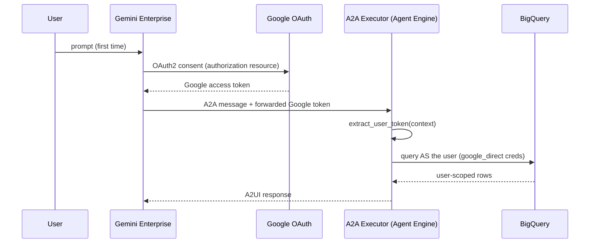

# Agent Framework

A config-driven multi-agent platform for deploying **A2UI**, **A2A**, and **Google ADK** agents to **Gemini Enterprise** via **Agent Engine**.

## Flagship Agent: emp_verify_google_oauth_v3

The **Employee Verification Google OAuth v3** agent (`emp_verify_google_oauth_v3`) is the current, actively
deployed agent in this repo. It demonstrates the production pattern for GE-hosted agents with **direct Google
OAuth On-Behalf-Of** — no Entra, no STS, no Workforce Identity Federation.

- **Hosting**: Vertex AI Agent Engine (Reasoning Engine) in `us-central1`.
- **GE registration**: Pure **A2A** (`a2aAgentDefinition`), not `adkAgentDefinition`. GE calls the Reasoning
  Engine's A2A URL directly from the agent card. This is required for A2UI DataParts (interactive forms) to
  render correctly in the GE chat UI.
- **Auth**: GE authorization resource uses **Google OAuth** (`accounts.google.com`). GE forwards the user's
  **Google access token** to the agent; BigQuery runs as that user (`OBO_CREDENTIAL_MODE=google_direct`).
- **A2UI catalog**: Uses `BasicCatalog` (not the repo-root `widgets/` package) because the KPMG widgets
  package is not available on Agent Engine's runtime.
- **Gallery name**: Search for **Employee Verification Google OAuth v3** in the GE Agent Gallery.

> **Note:** This repo previously included alternate agents (`emp_verify_v2` using Entra ID → Workforce
> Identity Federation, and an original `employee_verification` v1 reference implementation). Documentation
> for the legacy Entra/WIF path has moved to [`agents/emp_verify_v2/README.md`](agents/emp_verify_v2/README.md).
> This README covers `emp_verify_google_oauth_v3` only.

### Prerequisites (.env)

Use a **GCP OAuth 2.0 Web client** (not Entra) for the GE authorization resource:

```env
OAUTH_AUTHORIZATION_URI=https://accounts.google.com/o/oauth2/v2/auth
OAUTH_TOKEN_URI=https://oauth2.googleapis.com/token
OAUTH_SCOPES=https://www.googleapis.com/auth/bigquery https://www.googleapis.com/auth/cloud-platform openid email profile
OAUTH_CLIENT_ID=<GCP OAuth 2.0 Web client ID>
OAUTH_CLIENT_SECRET=<client secret>
OBO_CREDENTIAL_MODE=google_direct
```

Add these redirect URIs to the OAuth client in GCP Console → APIs & Services → Credentials:

- `https://vertexaisearch.cloud.google.com/oauth-redirect`
- `https://vertexaisearch.cloud.google.com/static/oauth/oauth.html`

Users who sign in need **BigQuery IAM** on the project/dataset (their Cloud Identity / Google account
principal), not Workforce pool principals.

### Deploying emp_verify_google_oauth_v3

```bash
cd employ_verification
python scripts/deploy.py emp_verify_google_oauth_v3
```

This single command reads `config/emp_verify_google_oauth_v3.yaml`'s `deploy:` block and:

1. **First-time deploy** (no `deploy.reasoning_engine` recorded yet, or that engine no longer exists):
   creates a brand-new Agent Engine (Reasoning Engine) resource, then automatically writes the new
   resource name back into the YAML.
2. **Redeploy** (an existing `deploy.reasoning_engine` is still valid): updates that **same** Reasoning
   Engine resource in place via `agent_engines.update()` — the resource name and A2A URL never change.
3. Creates the GE OAuth authorization resource (`deploy.agent_authorization_id`) if it doesn't already
   exist — this only ever happens once, on first deploy.
4. Registers (or PATCHes in place) the GE agent as `a2aAgentDefinition`. Because the underlying engine
   resource name doesn't change between deploys, the authorization is **never detached or reattached**
   on a normal redeploy — there's no "used by another agent" lock to wait out.
5. Sets gallery visibility to `ALL_USERS` so the agent appears in the GE Agent Gallery for all users.

No manual `setup_agent_auth.py` step is required for normal v3 deploys — auth resources are managed by
`deploy.py`.

If you deliberately need a brand-new Reasoning Engine (e.g. a change `update()` can't apply, like
`agent_framework`), use `--force-recreate-engine`. This deletes the current engine, waits 5 minutes for
eventual-consistency safety, then creates a new one and re-registers — the GE authorization resource
itself is untouched throughout (it's still attached to the same GE agent record, just pointed at a new
A2A URL).


### Re-registering an already-deployed engine (no redeploy)

```bash
python scripts/deploy.py emp_verify_google_oauth_v3 --register-only --reasoning-engine <RESOURCE_ID_OR_FULL_NAME>
```

The latest deployed engine ID is recorded in `config/emp_verify_google_oauth_v3.yaml` under
`deploy.reasoning_engine`.

### Validate Google OAuth OBO (outside GE)

```bash
gcloud auth print-access-token | python scripts/verify_google_oauth.py -
```

This exercises the same `google_direct` path the agent uses: Google access token → BigQuery as the user.

After deploying, watch engine logs for `OBO credential mode: google_direct` and
`BigQuery: using On-Behalf-Of user (google_direct) credentials` vs the ADC fallback line.

### Dry run

```bash
python scripts/deploy.py emp_verify_google_oauth_v3 --dry-run
```

---

## Architecture

```
dn-innov-a2ui/
├── widgets/                              # KPMG A2UI widgets library (shared)
│   ├── catalog/                          # Widget schema definitions
│   ├── examples/0.8/                     # Branded example payloads
│   └── python/                           # Builders + schema provider
│
└── employ_verification/                  # Agent platform
    ├── pyproject.toml                    # Shared dependencies
    ├── .env / .env.example               # Environment configuration
    ├── .gitignore
    │
    ├── adhoc/                            # One-time setup scripts (run before first deploy)
    │   ├── README.md                     # Instructions for each adhoc script
    │   └── setup_employee_bq.py          # Create BQ dataset, table, and mock data
    │
    ├── config/                           # Agent configurations (YAML)
    │   ├── _defaults.yaml                # Shared defaults (model, region, etc.)
    │   └── emp_verify_google_oauth_v3.yaml  # Flagship — Agent Engine + A2A + Google OAuth OBO
    │
    ├── agents/                           # Agent definitions (one folder per agent)
    │   ├── _base/                        # Shared base classes
    │   │   ├── config_loader.py          # YAML config loader + merger
    │   │   ├── base_executor.py          # Generic A2A/A2UI executor (captures OBO token per request)
    │   │   ├── agent_card.py             # A2A agent card builder with A2UI extension metadata
    │   │   └── user_context.py           # Extracts forwarded token; builds user Credentials
    │   │
    │   ├── emp_verify_google_oauth_v3/   # Employee Verification v3 (flagship, Google OAuth OBO)
    │   │   ├── agent.py                  # ADK Agent — BasicCatalog for Agent Engine
    │   │   └── executor.py               # Thin executor subclass
    │   │
    │   ├── employee_verification/        # Shared A2UI examples (used by v3's config)
    │   │   └── examples/0.8/             # A2UI JSON examples referenced by emp_verify_google_oauth_v3.yaml
    │   │
    │   └── emp_verify_v2/                # Legacy agent (Entra → WIF OBO) — see its own README
    │       └── README.md                 # Legacy Entra/WIF documentation
    │
    ├── tools/                            # Shared tool library
    │   ├── registry.py                   # Tool metadata catalog
    │   └── employee/                     # Tools grouped by domain
    │       ├── bq_client.py              # BigQuery client factory — OBO creds, else ADC fallback
    │       ├── lookup_employee.py
    │       ├── update_employee_field.py
    │       └── verify_employee.py
    │
    ├── scripts/                          # Deploy + lifecycle + diagnostics
    │   ├── deploy.py                     # Generic deploy CLI (Agent Engine create/update-in-place; stable auth resource)

    │   ├── undeploy.py                   # Tear down agents
    │   ├── grant_permissions.py          # IAM grants for OBO identities + service account
    │   ├── verify_google_oauth.py        # Google access token → BigQuery validation (v3)
    │   ├── debug_agent.py                # Consolidated logs/traces/diagnostics tool
    │   └── get_agent_card.py             # Fetch A2A agent card from a deployed Reasoning Engine
    │
    └── data/                             # Mock data, schemas, etc.
```

> Legacy scripts (`setup_agent_auth.py`, `verify_wif.py`, `get_entra_token.py`, `validate_wif_config.py`,
> `complete_wif_setup.ps1`, `setup_bigquery.py`) and the Entra→STS token-exchange module
> (`agents/_base/token_exchange.py`) still exist in the repo for the `emp_verify_v2` path. See
> [`agents/emp_verify_v2/README.md`](agents/emp_verify_v2/README.md) for details.

---

## Getting Started (New Project Setup)

Follow these steps **in order** when setting up in a new GCP project.

### Prerequisites
- Google Cloud Project with Vertex AI and Gemini Enterprise enabled
- `gcloud` CLI authenticated: `gcloud auth application-default login`
- Python 3.11+ with `uv` (recommended)
- **Windows corporate machine?** Add `SSL_VERIFY=false` to your `.env` (see Step 2)

---

### Step 1 — Install dependencies
```bash
cd employ_verification
uv sync
source .venv/bin/activate   # Windows: .venv\Scripts\activate
```

### Step 2 — Configure environment
```bash
cp .env.example .env
```

Edit `.env` and fill in the shared variables:

| Variable | Description |
|---|---|
| `PROJECT_ID` | Your GCP project ID |
| `LOCATION` | Agent Engine region (e.g. `us-central1`) |
| `STORAGE_BUCKET` | GCS bucket for staging (e.g. `gs://my-bucket`) |
| `GEMINI_ENTERPRISE_APP_ID` | Your GE app ID from the GCP Console |
| `GE_LOCATION` | GE app region: `global`, `us`, or `eu` (regional apps, e.g. `us`, cannot use `global` auth resources) |
| `SSL_VERIFY` | Set to `false` on Windows corporate machines with custom CAs |

Use a **GCP OAuth 2.0 Web client** for `emp_verify_google_oauth_v3`:

| Variable | Value |
|---|---|
| `OAUTH_CLIENT_ID` / `OAUTH_CLIENT_SECRET` | GCP OAuth 2.0 Web client (APIs & Services → Credentials) |
| `OAUTH_AUTHORIZATION_URI` | `https://accounts.google.com/o/oauth2/v2/auth` |
| `OAUTH_TOKEN_URI` | `https://oauth2.googleapis.com/token` |
| `OAUTH_SCOPES` | `https://www.googleapis.com/auth/bigquery https://www.googleapis.com/auth/cloud-platform openid email profile` |
| `OBO_CREDENTIAL_MODE` | `google_direct` |

> **Finding your GE App ID:** GCP Console → Vertex AI → Agent Builder → your app → copy the ID from the URL

### Step 3 — Enable required GCP APIs
```bash
gcloud services enable \
  aiplatform.googleapis.com \
  bigquery.googleapis.com \
  discoveryengine.googleapis.com \
  --project=$PROJECT_ID
```

### Step 4 — Set up BigQuery (mock employee data)
```bash
python adhoc/setup_employee_bq.py
```

### Step 5 — Grant IAM permissions
```bash
python scripts/grant_permissions.py
```
This grants least-privilege BigQuery access to the Reasoning Engine service account (ADC fallback). Ensure
end users have BigQuery access on the dataset under their Google / Cloud Identity account for OBO queries
to run as the user.

### Step 6 — Set up OAuth authorization resource

Skip this step — `deploy.py` creates the single stable auth resource (`agent_authorization_id` in the
YAML) automatically on first deploy, and reuses it on every redeploy.


> **OAuth client redirect URIs**:
> - `https://vertexaisearch.cloud.google.com/oauth-redirect`
> - `https://vertexaisearch.cloud.google.com/static/oauth/oauth.html`

### Step 7 — Deploy
```bash
python scripts/deploy.py emp_verify_google_oauth_v3
```

That's it! The agent deploys to Agent Engine, registers in Gemini Enterprise as a pure A2A agent, and
appears in the Agent Gallery as **Employee Verification Google OAuth v3**.

---

## On-Behalf-Of (OBO) — Google OAuth direct

The v3 agent skips Entra and Workforce Identity entirely. Users sign in with **Google** in Gemini
Enterprise; GE forwards a **Google OAuth access token** to the agent, and BigQuery runs as that user.

### How it works



### Key files

| File | Responsibility |
|------|----------------|
| `agents/_base/user_context.py` | `OBO_CREDENTIAL_MODE=google_direct` — wraps forwarded Google token in `Credentials` |
| `agents/_base/base_executor.py` | Sets `obo_credential_mode` from YAML per request; captures token into `ContextVar` |
| `tools/employee/bq_client.py` | `get_bigquery_client()` — user (OBO) creds, else ADC fallback |
| `config/emp_verify_google_oauth_v3.yaml` | `obo_credential_mode: google_direct`, `agent_authorization_id`, `reasoning_engine`, `ge_access_policy` |

If **no** user token is forwarded, tools transparently fall back to Application Default Credentials (the
Reasoning Engine service account).

### Auth resource lifecycle (single stable ID, no rotation)

`config/emp_verify_google_oauth_v3.yaml` defines one stable authorization ID and tracks the current
Reasoning Engine resource:

```yaml
agent_authorization_id: "auth-emp-verify-google-oauth-v3"
reasoning_engine: projects/.../locations/us-central1/reasoningEngines/1246408030514315264
```

- **First deploy**: `deploy.py` creates the auth resource once, creates the Reasoning Engine, and writes
  its resource name back into `reasoning_engine` automatically.
- **Every redeploy**: the same Reasoning Engine resource is updated in place (`agent_engines.update()`),
  so its name/A2A URL never changes — the GE agent registration is simply PATCHed, and the authorization
  is **never detached or reattached**. This is what avoids GE's `"used by another agent"` lock entirely
  during normal redeploys (GE can take several minutes to release a freed authorization, so avoiding the
  detach/reattach cycle matters).
- **`--force-recreate-engine`**: only needed for the rare case you must destroy and recreate the
  Reasoning Engine itself (e.g. certain runtime/framework changes). `deploy.py` waits 5 minutes after
  deleting the old engine before creating the new one and re-registering, as a safety margin — even
  though the authorization resource itself is untouched in this path (it stays attached to the same GE
  agent record; only the record's target A2A URL changes).


### Validating Google OAuth OBO (outside GE)

```bash
gcloud auth print-access-token | python scripts/verify_google_oauth.py -
```

Once deployed, use `python scripts/debug_agent.py emp_verify_google_oauth_v3 --follow` and watch for
`OBO credential mode: google_direct` and `BigQuery: using On-Behalf-Of user (google_direct) credentials`.

---

## Deploy CLI Reference

```bash
# Deploy the agent
python scripts/deploy.py emp_verify_google_oauth_v3

# Deploy ALL agents (reads every YAML in config/)
python scripts/deploy.py --all

# Dry run (shows config without deploying)
python scripts/deploy.py emp_verify_google_oauth_v3 --dry-run

# List available agents
python scripts/deploy.py --list

# Register an already-deployed Reasoning Engine (skip redeploy)
python scripts/deploy.py emp_verify_google_oauth_v3 --register-only --reasoning-engine <RESOURCE_ID>

# Undeploy an agent
python scripts/deploy.py emp_verify_google_oauth_v3 --undeploy
```

### Undeploy Script
```bash
# Undeploy the agent
python scripts/undeploy.py emp_verify_google_oauth_v3

# Undeploy all agents
python scripts/undeploy.py --all

# List agents registered in Gemini Enterprise
python scripts/undeploy.py --list
```

## Adding a New Agent

### 1. Create the config YAML
```bash
# config/my_new_agent.yaml
```
```yaml
agent:
  name: "MyNewAgent"
  display_name: "My New Agent"
  description: "What this agent does."

  tools:
    - "tools.my_domain.my_tool.my_function"

  a2ui:
    examples_dir: "agents/my_new_agent/examples/0.8"

  prompts:
    role: "You are a helpful assistant that..."
    workflow: "Follow these steps..."
    ui: "Render A2UI components..."

  actions:
    my_button_action:
      template: "User clicked: {context_var}"

deploy:
  deployment_target: agent_engine   # or cloud_run
  ge_registration: a2a              # required for A2UI/iframe support in GE
  agent_authorization_id: "auth-my-new-agent"

  extra_requirements:
    - "some-extra-package>=1.0"
  extra_packages:
    - "agents"
    - "tools"
    - "config"
    # Do NOT add "../widgets" for Agent Engine — use BasicCatalog in agent.py instead
  env_vars:
    NUM_WORKERS: "1"
  skills:
    - id: "my-skill"
      name: "My Skill"
      description: "What this skill does."
      examples: ["Example query 1", "Example query 2"]
```

### 2. Create the agent folder
```bash
mkdir -p agents/my_new_agent/examples/0.8
```

**agents/my_new_agent/agent.py** — Copy from `agents/emp_verify_google_oauth_v3/agent.py` and change `AGENT_CONFIG_NAME`.

**agents/my_new_agent/executor.py** — Just 3 lines:
```python
from agents._base.base_executor import BaseA2UIExecutor

class MyNewAgentExecutor(BaseA2UIExecutor):
    AGENT_CONFIG_NAME = "my_new_agent"
```

### 3. Add tools (if needed)
```bash
mkdir -p tools/my_domain
```
Create tool functions, add to `tools/registry.py`, import in `tools/my_domain/__init__.py`.

### 4. Deploy
```bash
python scripts/deploy.py my_new_agent
```

## Tool Registry

The tool registry (`tools/registry.py`) provides metadata for management:
```python
from tools.registry import get_tools_by_tag, get_tool_metadata, list_all_tools

employee_tools = get_tools_by_tag("employee")
read_tools = get_tools_by_operation("READ")
meta = get_tool_metadata("lookup_employee")
all_tools = list_all_tools()
```

## Config System

- **`config/_defaults.yaml`** — Shared defaults inherited by all agents (model, region, base requirements)
- **`config/<agent_name>.yaml`** — Agent-specific config that overrides defaults
- Configs are deep-merged: agent values override defaults, nested dicts are merged recursively

## Key Design Decisions

| Aspect | How it works |
|--------|-------------|
| **Hosting** | Vertex AI Agent Engine (Reasoning Engine) — KPMG standard for GE agents |
| **GE registration** | Pure A2A (`a2aAgentDefinition`) — required for A2UI DataParts in GE |
| **OBO** | Google OAuth direct — GE forwards Google access token; `OBO_CREDENTIAL_MODE=google_direct` |
| **Auth resources** | Single stable ID in YAML — created once on first deploy, never rotated/detached |
| **Config** | YAML files in `config/`, merged with `_defaults.yaml` |

| **Tools vs Skills** | Tools = Python functions the LLM calls. Skills = metadata for A2A routing |
| **Executor** | Base class in `agents/_base/base_executor.py`, agents subclass with 3 lines |
| **Deploy** | Generic `scripts/deploy.py` reads config, imports executor dynamically |
| **A2UI** | Examples in `agents/employee_verification/examples/0.8/`; uses `BasicCatalog` on Agent Engine |
| **KPMG Widgets** | Repo-root `widgets/` — local/dev only; not bundled for Agent Engine deploys |
