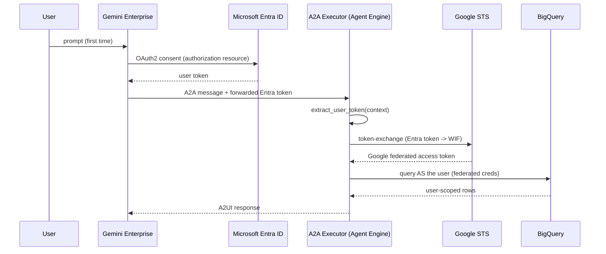

# Agent Framework

A config-driven multi-agent platform for deploying **A2UI**, **A2A**, and **Google ADK** agents to **Gemini Enterprise** via **Agent Engine**.

## Flagship Deployment: emp_verify_v2

The **Employee Verification v2** agent (`emp_verify_v2`) is the current, actively deployed agent in this
repo. It demonstrates the full production pattern KPMG uses for GE-hosted agents:

- **Hosting**: Vertex AI Agent Engine (Reasoning Engine) — **not** Cloud Run. KPMG standardized on
  Agent Engine hosting for this agent; a self-hosted Cloud Run A2A path (`server/a2a_app.py`, `Dockerfile`)
  exists in the codebase as a documented fallback/alternative, but is not used for `emp_verify_v2`.
- **GE registration**: Pure **A2A** (`a2aAgentDefinition`), not `adkAgentDefinition`. GE calls the Reasoning
  Engine's A2A URL directly from the agent card. This is required for A2UI DataParts (interactive forms) and
  iframes to render correctly in the GE chat UI — the `adk` registration path does not preserve the A2UI
  extension metadata needed for rich UI rendering.
- **Auth**: On-Behalf-Of (OBO) via Microsoft Entra ID → Google Workforce Identity Federation (WIF). See the
  dedicated section below.
- **Older agents** (`employee_verification` — the original v1) remain in the repo as a stable reference
  implementation; `emp_verify_v2` supersedes it as the actively deployed / demoed agent.

### Deploying emp_verify_v2

```bash
cd employ_verification
python scripts/deploy.py emp_verify_v2
```

This single command reads `config/emp_verify_v2.yaml`'s `deploy:` block and:
1. Deploys the ADK agent (wrapped as an `A2aAgent`) to Vertex AI Agent Engine in `us-central1`.
2. Resolves or creates the `auth-emp-verify-v2` Gemini Enterprise OAuth authorization resource
   (reusing the existing Entra OAuth client — see `.env`'s `OAUTH_CLIENT_ID`).
3. Unregisters any stale prior GE registration and re-registers as `a2aAgentDefinition`, pointing GE at the
   new Reasoning Engine's A2A URL.
4. Sets gallery visibility to `ALL_USERS` via `sharingConfig.scope` so the agent appears in the GE Agent
   Gallery for all users (not just admins).

If GE reports the authorization resource as `"used by another agent"` immediately after a redeploy, this is
a known transient race (GE's deletion of the previous registration is eventually consistent). `deploy.py`
now retries the registration call automatically (3 attempts, 3s/6s/10s backoff) before failing. If it's still
locked after retries, force-recreate the auth resource and re-register without a full redeploy:

```bash
python scripts/setup_agent_auth.py --id auth-emp-verify-v2 --force
python scripts/deploy.py emp_verify_v2 --register-only --reasoning-engine <RESOURCE_ID>
```

### Re-registering an already-deployed engine (no redeploy)

```bash
python scripts/deploy.py emp_verify_v2 --register-only --reasoning-engine <RESOURCE_ID_OR_FULL_NAME>
```

### Dry run

```bash
python scripts/deploy.py emp_verify_v2 --dry-run
```

---

## Architecture

```
dn-innov-a2ui/
├── widgets/                              # KPMG A2UI widgets library (shared)
│   ├── catalog/                          # Widget schema definitions
│   ├── examples/0.8/                     # Branded example payloads
│   └── python/                           # Builders + schema provider
│
└── employ_verification/                  # Agent platform
    ├── pyproject.toml                    # Shared dependencies
    ├── .env / .env.example               # Environment configuration
    ├── .gitignore
    │
    ├── adhoc/                            # One-time setup scripts (run before first deploy)
    │   ├── README.md                     # Instructions for each adhoc script
    │   └── setup_employee_bq.py          # Create BQ dataset, table, and mock data
    │
    ├── config/                           # Agent configurations (YAML)
    │   ├── _defaults.yaml                # Shared defaults (model, region, etc.)
    │   ├── emp_verify_v2.yaml            # Flagship agent — Agent Engine + pure A2A + OBO/WIF
    │   └── employee_verification.yaml    # Original v1 agent config
    │
    ├── agents/                           # Agent definitions (one folder per agent)
    │   ├── _base/                        # Shared base classes
    │   │   ├── config_loader.py          # YAML config loader + merger
    │   │   ├── base_executor.py          # Generic A2A/A2UI executor (captures OBO token per request)
    │   │   ├── agent_card.py             # A2A agent card builder with A2UI extension metadata
    │   │   ├── token_exchange.py         # RFC 8693 STS call: Entra token → Google WIF access token
    │   │   ├── user_context.py           # Extracts forwarded Entra token; builds user Credentials
    │   │   └── auth_middleware.py        # Optional ASGI fallback (self-hosted A2A / Cloud Run path)
    │   │
    │   ├── emp_verify_v2/                # Employee Verification v2 (flagship, Agent Engine + A2A)
    │   │   ├── agent.py                  # ADK Agent (reads from config YAML)
    │   │   └── executor.py               # Thin executor subclass (3 lines)
    │   │
    │   └── employee_verification/        # Employee Verification v1 (reference implementation)
    │       ├── agent.py
    │       ├── executor.py
    │       └── examples/0.8/             # A2UI JSON examples (shared with emp_verify_v2)
    │
    ├── tools/                            # Shared tool library
    │   ├── registry.py                   # Tool metadata catalog
    │   └── employee/                     # Tools grouped by domain
    │       ├── bq_client.py              # BigQuery client factory — OBO creds, else ADC fallback
    │       ├── lookup_employee.py
    │       ├── update_employee_field.py
    │       └── verify_employee.py
    │
    ├── scripts/                          # Deploy + lifecycle + diagnostics
    │   ├── deploy.py                     # Generic deploy CLI (Agent Engine + Cloud Run targets)
    │   ├── undeploy.py                   # Tear down agents
    │   ├── setup_agent_auth.py           # Create/recreate GE OAuth authorization resource
    │   ├── grant_permissions.py          # IAM grants for OBO/WIF + service account (least-privilege)
    │   ├── validate_wif_config.py        # Pre-flight .env alignment checks (offline)
    │   ├── verify_wif.py                 # Standalone Entra → STS → BigQuery validation
    │   ├── get_entra_token.py            # MSAL device-code flow to obtain a test Entra token
    │   ├── debug_agent.py                # Consolidated logs/traces/diagnostics tool
    │   └── get_agent_card.py             # Fetch A2A agent card from a deployed Reasoning Engine
    │
    ├── server/                           # Self-hosted A2A path (Cloud Run) — NOT used for emp_verify_v2
    │   └── a2a_app.py                    # FastAPI A2A server; documented fallback only
    │
    └── data/                             # Mock data, schemas, etc.
```

---

## Getting Started (New Project Setup)

Follow these steps **in order** when setting up in a new GCP project.

### Prerequisites
- Google Cloud Project with Vertex AI and Gemini Enterprise enabled
- `gcloud` CLI authenticated: `gcloud auth application-default login`
- Python 3.11+ with `uv` (recommended)
- **Windows corporate machine?** Add `SSL_VERIFY=false` to your `.env` (see Step 2)

---

### Step 1 — Install dependencies
```bash
cd employ_verification
uv sync
source .venv/bin/activate   # Windows: .venv\Scripts\activate
```

### Step 2 — Configure environment
```bash
cp .env.example .env
```

Edit `.env` and fill in:
| Variable | Description |
|---|---|
| `PROJECT_ID` | Your GCP project ID |
| `LOCATION` | Agent Engine region (e.g. `us-central1`) |
| `STORAGE_BUCKET` | GCS bucket for staging (e.g. `gs://my-bucket`) |
| `GEMINI_ENTERPRISE_APP_ID` | Your GE app ID from the GCP Console |
| `GE_LOCATION` | GE app region: `global`, `us`, or `eu` (regional apps, e.g. `us`, cannot use `global` auth resources) |
| `OAUTH_CLIENT_ID` / `OAUTH_CLIENT_SECRET` | Entra OAuth client that drives the GE login prompt |
| `SSL_VERIFY` | Set to `false` on Windows corporate machines with custom CAs |

> **Finding your GE App ID:** GCP Console → Vertex AI → Agent Builder → your app → copy the ID from the URL

### Step 3 — Enable required GCP APIs
```bash
gcloud services enable \
  aiplatform.googleapis.com \
  bigquery.googleapis.com \
  discoveryengine.googleapis.com \
  --project=$PROJECT_ID
```

### Step 4 — Set up BigQuery (mock employee data)
```bash
python adhoc/setup_employee_bq.py
```

### Step 5 — Grant IAM permissions
```bash
python scripts/grant_permissions.py
```
This grants least-privilege BigQuery access (`dataEditor` + `jobUser`, not `admin`) to the Reasoning Engine
service account (ADC fallback identity) and to the Workforce Identity pool principals (OBO identities).

### Step 6 — Set up OAuth authorization resource
```bash
python scripts/setup_agent_auth.py --id auth-emp-verify-v2
```

> **Prerequisites for this step:**
> - Create an OAuth 2.0 client in Azure/Entra (or reuse an existing one) for the GE login prompt
> - Add these redirect URIs to the client:
>   - `https://vertexaisearch.cloud.google.com/oauth-redirect`
>   - `https://vertexaisearch.cloud.google.com/static/oauth/oauth.html`
> - Set `OAUTH_CLIENT_ID` and `OAUTH_CLIENT_SECRET` in your `.env`

### Step 7 — Deploy
```bash
python scripts/deploy.py emp_verify_v2
```

That's it! The agent will be deployed to Agent Engine, registered in Gemini Enterprise as a pure A2A agent,
and made visible in the Agent Gallery.

---

## On-Behalf-Of (OBO) User Authentication — Entra ID → Workforce Identity

KPMG users sign in with **Microsoft Entra ID**, but BigQuery (and other Google
APIs) only accept **Google** credentials. To run queries *as the logged-in user*
(so user-level ACLs and audit logs are honored) the agent performs an
On-Behalf-Of token exchange.

### How it works



### Two distinct Entra apps — do not confuse them

| App | Role |
|---|---|
| **GE OAuth Client** (`OAUTH_CLIENT_ID` in `.env`) | Drives the login prompt GE shows the user. Used only on the GE authorization resource (`serverSideOauth2`). |
| **WIF API App** (`WIF_PROVIDER_OIDC_CLIENT_ID`) | The audience the Workforce Identity Pool provider expects on the forwarded Entra access token. This is what Google STS validates against. |

These are separate Entra App Registrations. The GE OAuth client must request a scope
(`api://<WIF_APP_ID>/<scope-name>`) against the WIF API app so the token GE forwards has the right audience
for the STS exchange.

### Key files

| File | Responsibility |
|------|----------------|
| `agents/_base/token_exchange.py` | RFC 8693 STS call: Entra token → Workforce (WIF) access token |
| `agents/_base/user_context.py` | Extracts the forwarded token from the A2A request; builds user `Credentials` |
| `agents/_base/auth_middleware.py` | Optional ASGI fallback that captures the `Authorization` header (self-hosted only) |
| `agents/_base/base_executor.py` | Captures the user token per request into a `ContextVar` |
| `tools/employee/bq_client.py` | `get_bigquery_client()` — user (OBO) creds, else ADC fallback |

If **no** user token is forwarded (authorization disabled, or a machine-to-machine
call) the tools transparently fall back to Application Default Credentials.

### Requirements for OBO to actually engage

1. **A Workforce Pool + OIDC provider** trusting your Entra tenant:
   ```env
   WORKFORCE_POOL_ID=azure-oidc-agentspace-dev-app
   WORKFORCE_PROVIDER_ID=azure-dev-oidc-provider
   WORKFORCE_POOL_LOCATION=global
   WIF_SUBJECT_TOKEN_TYPE=jwt
   ```
   Verify with:
   ```bash
   gcloud iam workforce-pools providers describe azure-dev-oidc-provider \
     --workforce-pool=azure-oidc-agentspace-dev-app --location=global
   ```
2. **An Entra authorization resource** so Gemini Enterprise forwards the token, requesting the WIF API
   app's custom scope (not Microsoft Graph scopes):
   ```env
   OAUTH_CLIENT_ID=<GE OAuth client ID>
   OAUTH_CLIENT_SECRET=<secret from Azure Portal for that app>
   OAUTH_AUTHORIZATION_URI=https://login.microsoftonline.com/<TENANT_ID>/oauth2/v2.0/authorize
   OAUTH_TOKEN_URI=https://login.microsoftonline.com/<TENANT_ID>/oauth2/v2.0/token
   OAUTH_SCOPES="openid offline_access api://<WIF_APP_ID>/<scope-name>"
   ```
   ```bash
   python scripts/setup_agent_auth.py --id auth-emp-verify-v2
   ```
3. **IAM for the federated users** — the pool principals need BigQuery + Agent access plus
   `roles/serviceusage.serviceUsageConsumer` (required for STS `userProject` billing):
   ```bash
   python scripts/grant_permissions.py
   ```

### Validating OBO end-to-end (outside of GE)

```bash
python scripts/get_entra_token.py        # MSAL device-code login, prints an Entra token
python scripts/verify_wif.py <ENTRA_ACCESS_TOKEN>   # Entra -> STS -> BigQuery smoke test
```

`verify_wif.py` exercises the agent's own `token_exchange.py` code path, so what you validate there is
exactly what runs in production.

Once deployed, use `python scripts/debug_agent.py emp_verify_v2 --follow` and watch for
`BigQuery: using On-Behalf-Of user (federated) credentials` vs the ADC fallback line to confirm which
identity ran a query.

**Note on `.entra_token.tmp`**: `get_entra_token.py` writes the fetched token to this file for convenience
during manual testing. It is gitignored — never commit it, it is a live credential.

---

## Deploy CLI Reference

```bash
# Deploy a SINGLE agent
python scripts/deploy.py emp_verify_v2

# Deploy MULTIPLE specific agents
python scripts/deploy.py emp_verify_v2 employee_verification

# Deploy ALL agents (reads every YAML in config/)
python scripts/deploy.py --all

# Dry run (shows config without deploying)
python scripts/deploy.py emp_verify_v2 --dry-run

# List available agents
python scripts/deploy.py --list

# Register an already-deployed Reasoning Engine (skip redeploy)
python scripts/deploy.py emp_verify_v2 --register-only --reasoning-engine <RESOURCE_ID>

# Undeploy an agent
python scripts/deploy.py emp_verify_v2 --undeploy
```

### Undeploy Script
```bash
# Undeploy a single agent
python scripts/undeploy.py emp_verify_v2

# Undeploy all agents
python scripts/undeploy.py --all

# List agents registered in Gemini Enterprise
python scripts/undeploy.py --list
```

## Adding a New Agent

### 1. Create the config YAML
```bash
# config/my_new_agent.yaml
```
```yaml
agent:
  name: "MyNewAgent"
  display_name: "My New Agent"
  description: "What this agent does."

  tools:
    - "tools.my_domain.my_tool.my_function"

  a2ui:
    examples_dir: "agents/my_new_agent/examples/0.8"

  prompts:
    role: "You are a helpful assistant that..."
    workflow: "Follow these steps..."
    ui: "Render A2UI components..."

  actions:
    my_button_action:
      template: "User clicked: {context_var}"

deploy:
  deployment_target: agent_engine   # or cloud_run
  ge_registration: a2a              # required for A2UI/iframe support in GE
  agent_authorization_id: "auth-my-new-agent"

  extra_requirements:
    - "some-extra-package>=1.0"
  extra_packages:
    - "agents"
    - "tools"
    - "config"
    - "../widgets"
  env_vars:
    NUM_WORKERS: "1"
  skills:
    - id: "my-skill"
      name: "My Skill"
      description: "What this skill does."
      examples: ["Example query 1", "Example query 2"]
```

### 2. Create the agent folder
```bash
mkdir -p agents/my_new_agent/examples/0.8
```

**agents/my_new_agent/agent.py** — Copy from `agents/emp_verify_v2/agent.py` and change `AGENT_CONFIG_NAME`.

**agents/my_new_agent/executor.py** — Just 3 lines:
```python
from agents._base.base_executor import BaseA2UIExecutor

class MyNewAgentExecutor(BaseA2UIExecutor):
    AGENT_CONFIG_NAME = "my_new_agent"
```

### 3. Add tools (if needed)
```bash
mkdir -p tools/my_domain
```
Create tool functions, add to `tools/registry.py`, import in `tools/my_domain/__init__.py`.

### 4. Deploy
```bash
python scripts/deploy.py my_new_agent
```

## Tool Registry

The tool registry (`tools/registry.py`) provides metadata for management:
```python
from tools.registry import get_tools_by_tag, get_tool_metadata, list_all_tools

employee_tools = get_tools_by_tag("employee")
read_tools = get_tools_by_operation("READ")
meta = get_tool_metadata("lookup_employee")
all_tools = list_all_tools()
```

## Config System

- **`config/_defaults.yaml`** — Shared defaults inherited by all agents (model, region, base requirements)
- **`config/<agent_name>.yaml`** — Agent-specific config that overrides defaults
- Configs are deep-merged: agent values override defaults, nested dicts are merged recursively

## Key Design Decisions

| Aspect | How it works |
|--------|-------------|
| **Hosting** | Vertex AI Agent Engine (Reasoning Engine), not Cloud Run — KPMG standard for GE agents |
| **GE registration** | Pure A2A (`a2aAgentDefinition`) — required for A2UI DataParts and iframes to render in GE |
| **OBO/WIF** | Entra ID → Google STS → Workforce Identity Federation, per-request via `ContextVar` |
| **Config** | YAML files in `config/`, merged with `_defaults.yaml` |
| **Tools vs Skills** | Tools = Python functions the LLM calls. Skills = metadata for A2A routing |
| **Executor** | Base class in `agents/_base/base_executor.py`, agents subclass with 3 lines |
| **Deploy** | Generic `scripts/deploy.py` reads config, imports executor dynamically, retries transient GE auth-lock races |
| **A2UI** | Examples stored per-agent in `agents/<name>/examples/0.8/` |
| **KPMG Widgets** | Shared branded patterns in repo-root `widgets/` — see `../widgets/README.md` |
