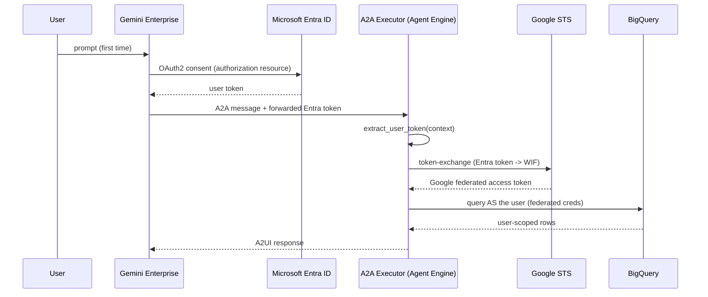

# Agent Framework

A config-driven multi-agent platform for deploying **A2UI**, **A2A**, and **Google ADK** agents to **Gemini Enterprise** via **Agent Engine**.

## Architecture

```
dn-innov-a2ui/
├── widgets/                              # KPMG A2UI widgets library (shared)
│   ├── catalog/                          # Widget schema definitions
│   ├── examples/0.8/                     # Branded example payloads
│   └── python/                           # Builders + schema provider
│
└── poc/                                  # Agent platform
    ├── pyproject.toml                    # Shared dependencies
    ├── .env / .env.example               # Environment configuration
    ├── .gitignore
    │
    ├── adhoc/                            # One-time setup scripts (run before first deploy)
    │   ├── README.md                     # Instructions for each adhoc script
    │   └── setup_employee_bq.py          # Create BQ dataset, table, and mock data
    │
    ├── config/                           # Agent configurations (YAML)
    │   ├── _defaults.yaml                # Shared defaults (model, region, etc.)
    │   └── employee_verification.yaml    # Agent-specific config
    │
    ├── agents/                           # Agent definitions (one folder per agent)
    │   ├── _base/                        # Shared base classes
    │   │   ├── config_loader.py          # YAML config loader + merger
    │   │   └── base_executor.py          # Generic A2A/A2UI executor
    │   │
    │   └── employee_verification/        # Employee Verification Agent
    │       ├── agent.py                  # ADK Agent (reads from config YAML)
    │       ├── executor.py               # Thin executor subclass (3 lines)
    │       └── examples/0.8/             # A2UI JSON examples for this agent
    │           ├── employee_list.json
    │           ├── employee_verification_form.json
    │           ├── action_confirmation.json
    │           └── verification_success.json
    │
    ├── tools/                            # Shared tool library
    │   ├── registry.py                   # Tool metadata catalog
    │   └── employee/                     # Tools grouped by domain
    │       ├── lookup_employee.py
    │       ├── update_employee_field.py
    │       └── verify_employee.py
    │
    ├── scripts/                          # Deploy + lifecycle scripts
    │   ├── deploy.py                     # Generic deploy CLI
    │   ├── undeploy.py                   # Tear down agents
    │   └── setup_agent_auth.py           # Create GE OAuth authorization resource
    │
    └── data/                             # Mock data, schemas, etc.
```

---

## Getting Started (New Project Setup)

Follow these steps **in order** when setting up in a new GCP project.

### Prerequisites
- Google Cloud Project with Vertex AI and Gemini Enterprise enabled
- `gcloud` CLI authenticated: `gcloud auth application-default login`
- Python 3.11+ with `uv` (recommended)
- **Windows corporate machine?** Add `SSL_VERIFY=false` to your `.env` (see Step 2)

---

### Step 1 — Install dependencies
```bash
cd kpmg_agents
uv sync
source .venv/bin/activate   # Windows: .venv\Scripts\activate
```

### Step 2 — Configure environment
```bash
cp .env.example .env
```

Edit `.env` and fill in:
| Variable | Description |
|---|---|
| `PROJECT_ID` | Your GCP project ID |
| `LOCATION` | Agent Engine region (e.g. `us-central1`) |
| `STORAGE_BUCKET` | GCS bucket for staging (e.g. `gs://my-bucket`) |
| `GEMINI_ENTERPRISE_APP_ID` | Your GE app ID from the GCP Console |
| `GE_LOCATION` | GE app region: `global`, `us`, or `eu` |
| `OAUTH_CLIENT_ID` | OAuth 2.0 client ID (for agent authorization) |
| `OAUTH_CLIENT_SECRET` | OAuth 2.0 client secret |
| `SSL_VERIFY` | Set to `false` on Windows corporate machines with custom CAs |

> **Finding your GE App ID:** GCP Console → Vertex AI → Agent Builder → your app → copy the ID from the URL

### Step 3 — Enable required GCP APIs
```bash
gcloud services enable \
  aiplatform.googleapis.com \
  bigquery.googleapis.com \
  discoveryengine.googleapis.com \
  --project=$PROJECT_ID
```

### Step 4 — Set up BigQuery (mock employee data)
```bash
python adhoc/setup_employee_bq.py
```

This creates the `employee_verification` dataset and loads 6 test employees.
It also **prints the exact IAM commands** you need to run in Step 5.

### Step 5 — Grant IAM permissions to Agent Engine
Copy and run the `gcloud` commands printed by Step 4. They look like:
```bash
gcloud projects add-iam-policy-binding YOUR_PROJECT_ID \
  --member="serviceAccount:service-PROJECT_NUMBER@gcp-sa-aiplatform-re.iam.gserviceaccount.com" \
  --role="roles/aiplatform.user"

gcloud projects add-iam-policy-binding YOUR_PROJECT_ID \
  --member="serviceAccount:service-PROJECT_NUMBER@gcp-sa-aiplatform-re.iam.gserviceaccount.com" \
  --role="roles/bigquery.dataViewer"

gcloud projects add-iam-policy-binding YOUR_PROJECT_ID \
  --member="serviceAccount:service-PROJECT_NUMBER@gcp-sa-aiplatform-re.iam.gserviceaccount.com" \
  --role="roles/bigquery.jobUser"
```

### Step 6 — Set up OAuth authorization resource
```bash
python scripts/setup_agent_auth.py
```

> **Prerequisites for this step:**
> - Create an OAuth 2.0 Web Application client in GCP Console → APIs & Services → Credentials
> - Add these redirect URIs to the client:
>   - `https://vertexaisearch.cloud.google.com/oauth-redirect`
>   - `https://vertexaisearch.cloud.google.com/static/oauth/oauth.html`
> - Set `OAUTH_CLIENT_ID` and `OAUTH_CLIENT_SECRET` in your `.env`

### Step 7 — Deploy
```bash
python scripts/deploy.py employee_verification
```

That's it! The agent will be deployed to Agent Engine and registered in Gemini Enterprise.

---

## On-Behalf-Of (OBO) User Authentication — Entra ID → Workforce Identity

KPMG users sign in with **Microsoft Entra ID**, but BigQuery (and other Google
APIs) only accept **Google** credentials. To run queries *as the logged-in user*
(so user-level ACLs and audit logs are honored) the agent performs an
On-Behalf-Of token exchange.

### How it works



Key pieces added to the codebase:

| File | Responsibility |
|------|----------------|
| `agents/_base/token_exchange.py` | RFC 8693 STS call: Entra token → Workforce (WIF) access token |
| `agents/_base/user_context.py` | Extracts the forwarded token from the A2A request; builds user `Credentials` |
| `agents/_base/auth_middleware.py` | Optional ASGI fallback that captures the `Authorization` header (self-hosted) |
| `agents/_base/base_executor.py` | Captures the user token per request into a `ContextVar` |
| `tools/employee/bq_client.py` | `get_bigquery_client()` — user (OBO) creds, else ADC fallback |

If **no** user token is forwarded (authorization disabled, or a machine-to-machine
call) the tools transparently fall back to Application Default Credentials.

### Requirements for OBO to actually engage

1. **A Workforce Pool + OIDC provider** trusting your Entra tenant. For this
   project the dev pool is already provisioned:
   ```env
   WORKFORCE_POOL_ID=azure-oidc-agentspace-dev-app
   WORKFORCE_PROVIDER_ID=azure-dev-oidc-provider
   WORKFORCE_POOL_LOCATION=global
   WIF_SUBJECT_TOKEN_TYPE=jwt
   ```
   The provider's Entra app client ID is `49818a2b-fed8-448b-a477-47c8658ba9ea`.
   Verify with:
   ```bash
   gcloud iam workforce-pools providers describe azure-dev-oidc-provider \
     --workforce-pool=azure-oidc-agentspace-dev-app --location=global
   ```
2. **An Entra authorization resource** so Gemini Enterprise forwards the token.
   `OAUTH_CLIENT_ID` **must match** the WIF provider's `oidc.clientId` above.
   Request the custom API scope (not Microsoft Graph scopes):
   ```env
   OAUTH_CLIENT_ID=49818a2b-fed8-448b-a477-47c8658ba9ea
   OAUTH_CLIENT_SECRET=<secret from Azure Portal for that app>
   OAUTH_AUTHORIZATION_URI=https://login.microsoftonline.com/<TENANT_ID>/oauth2/v2.0/authorize
   OAUTH_TOKEN_URI=https://login.microsoftonline.com/<TENANT_ID>/oauth2/v2.0/token
   OAUTH_SCOPES="openid offline_access api://49818a2b-fed8-448b-a477-47c8658ba9ea/access_as_user"
   ```
   ```bash
   python scripts/setup_agent_auth.py --id auth-employee-verification
   ```
   > `AGENT_AUTHORIZATION` **must not** be `none` — that is why every call is
   > currently anonymous and BigQuery falls back to the service account.
3. **IAM for the federated users** — the pool principals need BigQuery + Agent
   access plus `roles/serviceusage.serviceUsageConsumer` (required for STS
   `userProject` billing). Run:
   ```bash
   python scripts/grant_permissions.py
   ```

### One-shot setup (after `.env` is filled in)

```powershell
# Validate alignment, grant IAM, create auth resource, deploy
.\scripts\complete_wif_setup.ps1
```

Or step-by-step:
```bash
python scripts/validate_wif_config.py          # pre-flight checks
python scripts/grant_permissions.py
python scripts/setup_agent_auth.py --id auth-employee-verification
python scripts/deploy.py employee_verification
python scripts/verify_wif.py <ENTRA_ACCESS_TOKEN>   # optional STS smoke test
```

Once deployed, use `python scripts/debug_agent.py employee_verification --follow`
and watch for `BigQuery: using On-Behalf-Of user (federated) credentials` vs the
ADC fallback line to confirm which identity ran a query.

---

## Deploy CLI Reference

```bash
# Deploy a SINGLE agent
python scripts/deploy.py employee_verification

# Deploy MULTIPLE specific agents
python scripts/deploy.py employee_verification benefits_enrollment

# Deploy ALL agents (reads every YAML in config/)
python scripts/deploy.py --all

# Dry run (shows config without deploying)
python scripts/deploy.py employee_verification --dry-run

# List available agents
python scripts/deploy.py --list

# Undeploy an agent
python scripts/deploy.py employee_verification --undeploy
```

### Undeploy Script
```bash
# Undeploy a single agent
python scripts/undeploy.py employee_verification

# Undeploy all agents
python scripts/undeploy.py --all

# List agents registered in Gemini Enterprise
python scripts/undeploy.py --list
```

## Adding a New Agent

### 1. Create the config YAML
```bash
# config/my_new_agent.yaml
```
```yaml
agent:
  name: "MyNewAgent"
  display_name: "My New Agent"
  description: "What this agent does."
  # model: "gemini-2.5-pro"  # Override default model

  tools:
    - "tools.my_domain.my_tool.my_function"

  a2ui:
    examples_dir: "agents/my_new_agent/examples/0.8"

  prompts:
    role: "You are a helpful assistant that..."
    workflow: "Follow these steps..."
    ui: "Render A2UI components..."

  actions:
    my_button_action:
      template: "User clicked: {context_var}"

deploy:
  extra_requirements:
    - "some-extra-package>=1.0"
  extra_packages:
    - "agents/my_new_agent"
    - "tools"
  env_vars:
    NUM_WORKERS: "1"
  skills:
    - id: "my-skill"
      name: "My Skill"
      description: "What this skill does."
      examples: ["Example query 1", "Example query 2"]
```

### 2. Create the agent folder
```bash
mkdir -p agents/my_new_agent/examples/0.8
```

**agents/my_new_agent/agent.py** — Copy from employee_verification and change `AGENT_CONFIG_NAME`:
```python
from agents._base.config_loader import load_agent_config, resolve_tool_functions
# ... (same pattern as employee_verification/agent.py)
AGENT_CONFIG_NAME = "my_new_agent"
```

**agents/my_new_agent/executor.py** — Just 3 lines:
```python
from agents._base.base_executor import BaseA2UIExecutor

class MyNewAgentExecutor(BaseA2UIExecutor):
    AGENT_CONFIG_NAME = "my_new_agent"
```

### 3. Add tools (if needed)
```bash
mkdir -p tools/my_domain
```
Create tool functions, add to `tools/registry.py`, import in `tools/my_domain/__init__.py`.

### 4. Deploy
```bash
python scripts/deploy.py my_new_agent
```

That's it! No touching deploy code, no touching other agents.

## Adding New Tools

1. Create a new file in `tools/<domain>/` (e.g., `tools/benefits/lookup_benefits.py`)
2. Add metadata entry in `tools/registry.py`
3. Import in `tools/<domain>/__init__.py`
4. Add the dot-path to the agent's config YAML under `agent.tools`

## Tool Registry

The tool registry (`tools/registry.py`) provides metadata for management:
```python
from tools.registry import get_tools_by_tag, get_tool_metadata, list_all_tools

# Find all employee tools
employee_tools = get_tools_by_tag("employee")

# Find all read-only tools
read_tools = get_tools_by_operation("READ")

# Get metadata for a specific tool
meta = get_tool_metadata("lookup_employee")

# List all registered tools
all_tools = list_all_tools()
```

## Config System

- **`config/_defaults.yaml`** — Shared defaults inherited by all agents (model, region, base requirements)
- **`config/<agent_name>.yaml`** — Agent-specific config that overrides defaults
- Configs are deep-merged: agent values override defaults, nested dicts are merged recursively

## Key Design Decisions

| Aspect | How it works |
|--------|-------------|
| **Config** | YAML files in `config/`, merged with `_defaults.yaml` |
| **Tools vs Skills** | Tools = Python functions the LLM calls. Skills = metadata for A2A routing |
| **Executor** | Base class in `agents/_base/base_executor.py`, agents subclass with 3 lines |
| **Deploy** | Generic `scripts/deploy.py` reads config, imports executor dynamically |
| **A2UI** | Examples stored per-agent in `agents/<name>/examples/0.8/` |
| **KPMG Widgets** | Shared branded patterns in repo-root `widgets/` — see `../widgets/README.md` |
