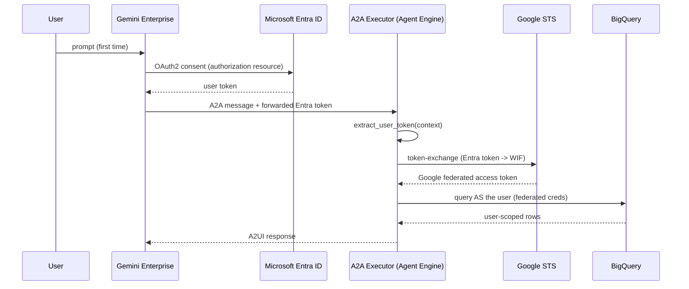

# emp_verify_v2 (Legacy) — Entra ID → Workforce Identity Federation OBO

> **Status: legacy / alternative path.** The actively maintained and deployed agent in this repo is
> [`emp_verify_google_oauth_v3`](../../README.md), which uses direct Google OAuth OBO (no Entra, no STS, no
> Workforce Identity Federation). `emp_verify_v2` remains in the repo for environments that require Entra
> ID sign-in instead of Google sign-in.

`emp_verify_v2` uses **Microsoft Entra ID → Google STS → Workforce Identity Federation** for On-Behalf-Of
(OBO) BigQuery access. KPMG users sign in with **Microsoft Entra ID**, but BigQuery (and other Google APIs)
only accept **Google** credentials. To run queries *as the logged-in user* (so user-level ACLs and audit
logs are honored) the agent performs an OBO token exchange.

## Deploying emp_verify_v2

```bash
cd employ_verification
python scripts/deploy.py emp_verify_v2
```

If GE reports the authorization resource as `"used by another agent"` after redeploy, `deploy.py` retries
automatically. If still locked:

```bash
python scripts/setup_agent_auth.py --id auth-emp-verify-v2 --force
python scripts/deploy.py emp_verify_v2 --register-only --reasoning-engine <RESOURCE_ID>
```

## How it works



## Two distinct Entra apps — do not confuse them

| App | Role |
|---|---|
| **GE OAuth Client** (`OAUTH_CLIENT_ID` in `.env`) | Drives the login prompt GE shows the user. Used only on the GE authorization resource (`serverSideOauth2`). |
| **WIF API App** (`WIF_PROVIDER_OIDC_CLIENT_ID`) | The audience the Workforce Identity Pool provider expects on the forwarded Entra access token. This is what Google STS validates against. |

These are separate Entra App Registrations. The GE OAuth client must request a scope
(`api://<WIF_APP_ID>/<scope-name>`) against the WIF API app so the token GE forwards has the right audience
for the STS exchange.

## Key files

| File | Responsibility |
|------|----------------|
| `agents/_base/token_exchange.py` | RFC 8693 STS call: Entra token → Workforce (WIF) access token |
| `agents/_base/user_context.py` | Extracts the forwarded token from the A2A request; builds user `Credentials` |
| `agents/_base/base_executor.py` | Captures the user token per request into a `ContextVar` |
| `tools/employee/bq_client.py` | `get_bigquery_client()` — user (OBO) creds, else ADC fallback |
| `config/emp_verify_v2.yaml` | Agent + deploy config for `emp_verify_v2` |
| `agents/emp_verify_v2/agent.py` / `executor.py` | Agent implementation |

If **no** user token is forwarded (authorization disabled, or a machine-to-machine call) the tools
transparently fall back to Application Default Credentials.

## Requirements for OBO to actually engage

1. **A Workforce Pool + OIDC provider** trusting your Entra tenant:
   ```env
   WORKFORCE_POOL_ID=azure-oidc-agentspace-dev-app
   WORKFORCE_PROVIDER_ID=azure-dev-oidc-provider
   WORKFORCE_POOL_LOCATION=global
   WIF_SUBJECT_TOKEN_TYPE=jwt
   ```
   Verify with:
   ```bash
   gcloud iam workforce-pools providers describe azure-dev-oidc-provider \
     --workforce-pool=azure-oidc-agentspace-dev-app --location=global
   ```
2. **An Entra authorization resource** so Gemini Enterprise forwards the token, requesting the WIF API
   app's custom scope (not Microsoft Graph scopes):
   ```env
   OAUTH_CLIENT_ID=<GE OAuth client ID>
   OAUTH_CLIENT_SECRET=<secret from Azure Portal for that app>
   OAUTH_AUTHORIZATION_URI=https://login.microsoftonline.com/<TENANT_ID>/oauth2/v2.0/authorize
   OAUTH_TOKEN_URI=https://login.microsoftonline.com/<TENANT_ID>/oauth2/v2.0/token
   OAUTH_SCOPES="openid offline_access api://<WIF_APP_ID>/<scope-name>"
   ```
   ```bash
   python scripts/setup_agent_auth.py --id auth-emp-verify-v2
   ```
3. **IAM for the federated users** — the pool principals need BigQuery + Agent access plus
   `roles/serviceusage.serviceUsageConsumer` (required for STS `userProject` billing):
   ```bash
   python scripts/grant_permissions.py
   ```

## Validating OBO end-to-end (outside of GE)

```bash
python scripts/get_entra_token.py        # MSAL device-code login, prints an Entra token
python scripts/verify_wif.py <ENTRA_ACCESS_TOKEN>   # Entra -> STS -> BigQuery smoke test
```

`verify_wif.py` exercises the agent's own `token_exchange.py` code path, so what you validate there is
exactly what runs in production.

Once deployed, use `python scripts/debug_agent.py emp_verify_v2 --follow` and watch for
`BigQuery: using On-Behalf-Of user (federated) credentials` vs the ADC fallback line to confirm which
identity ran a query.

**Note on `.entra_token.tmp`**: `get_entra_token.py` writes the fetched token to this file for convenience
during manual testing. It is gitignored — never commit it, it is a live credential.

## Pre-flight config validation

```bash
python scripts/validate_wif_config.py
```

Checks `.env` alignment for the Entra → WIF → OBO path before running `setup_agent_auth.py` / `deploy.py`.
Does not call Google Cloud APIs (safe to run offline).

There is also a PowerShell convenience wrapper for the full setup sequence:

```powershell
.\scripts\complete_wif_setup.ps1
```

## Related scripts

| Script | Purpose |
|---|---|
| `scripts/setup_agent_auth.py` | Create/recreate the GE OAuth authorization resource (manual, v2-only — v3 does this automatically) |
| `scripts/verify_wif.py` | Entra → STS → BigQuery validation |
| `scripts/get_entra_token.py` | MSAL device-code flow to fetch a test Entra token |
| `scripts/validate_wif_config.py` | Pre-flight `.env` alignment checks |
| `scripts/complete_wif_setup.ps1` | End-to-end setup wrapper (PowerShell) |
| `scripts/setup_bigquery.py` | Older/duplicate BigQuery setup script — prefer `adhoc/setup_employee_bq.py` |
