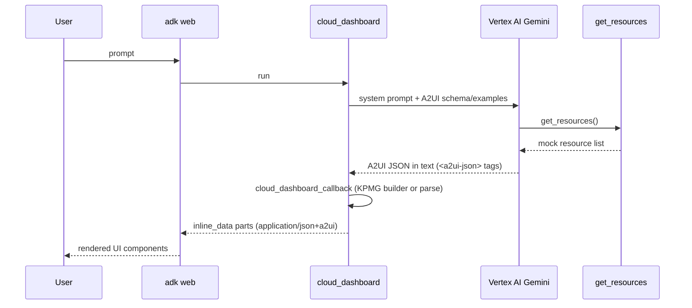

# A2UI Local Sample (POC)

Local development sample for testing **KPMG A2UI widgets** with the Google **ADK + A2UI** stack. It follows the [ADK + A2UI Codelab](https://codelabs.developers.google.com/next26/adk-a2ui) pattern: a mock cloud-dashboard agent that renders interactive UI in `adk web` instead of plain text.

The agent code lives **flat in this folder** (no sub-package). Widget definitions and few-shot examples come from the shared library at [`../widgets/`](../widgets/).

## What you get

- **`cloud_dashboard`** agent — answers questions about mock cloud resources (`auth-service`, `events-db`, `analytics-pipeline`)
- **A2UI v0.8** responses rendered as cards, icons, and buttons inside the ADK dev UI
- **KPMG branding** — `#00338D` primary color, Roboto font, KPMG widget examples in the system prompt

## Prerequisites

- Python 3.11+
- [uv](https://docs.astral.sh/uv/) (recommended)
- GCP project with **Vertex AI** enabled
- Authenticated ADC credentials:

```bash
gcloud auth application-default login
```

On **Windows corporate machines** (Zscaler, Netskope, etc.), you will likely need `SSL_VERIFY=false` or a corporate CA bundle in `.env` — see [SSL / corporate proxy](#ssl--corporate-proxy).

## Quick start

```bash
cd poc
uv sync
cp .env.example .env
# Edit .env — set GOOGLE_CLOUD_PROJECT (and SSL_VERIFY if needed)

python run_local.py
```

1. Open **http://127.0.0.1:8080/dev-ui/?app=poc**
2. Confirm the dropdown shows **poc** (not `scripts` or other repo folders)
3. Click **+ New Session**
4. Try a sample prompt below

> Always use `python run_local.py` from the `poc/` folder — do not run `adk web` from inside `poc/scripts/` (see [Troubleshooting](#troubleshooting)).

## Sample prompts

| Prompt | Expected UI |
|--------|-------------|
| `What's running in my project?` | Full resource dashboard (3 cards) |
| `Does anything need my attention?` | Filtered view — warning + error resources |
| `I need to deploy a new service` | Deployment-oriented layout (varies by model) |

After code changes, restart the server and start a **new session** so the agent and callback reload cleanly.

Verify the shared widget integration without starting the server:

```bash
python verify_widgets.py
```

## Project layout

```
poc/
├── agent.py            # ADK agent: schema prompt, tool, model, dashboard callback
├── dashboard_callback.py  # Injects KPMG resource dashboard after get_resources
├── resources.py        # Mock cloud resource data (codelab)
├── ssl_config.py       # Corporate proxy / TLS helpers for Vertex AI
├── run_local.py        # Starts adk web from repo root (app = poc)
├── pyproject.toml
├── .env.example
└── README.md
```

Shared widget library (repo root):

```
widgets/
├── catalog/kpmg_catalog_definition.json
├── examples/0.8/          # Few-shot A2UI payloads (incl. resource dashboard)
└── python/
    ├── provider.py        # KpmgWidgetsCatalog for A2uiSchemaManager
    ├── a2ui_utils.py      # a2ui_callback for adk web rendering
    ├── theme.py           # KPMG brand tokens (#00338D, Roboto)
    └── builders.py        # Programmatic A2UI payload builders
```

## How it works



### 1. System prompt (`agent.py`)

`A2uiSchemaManager` combines:

- A2UI v0.8 component schema
- KPMG widget few-shot examples via `KpmgWidgetsCatalog.get_catalogs_for_agent()`
- Role, workflow, and UI instructions (cards, icons, KPMG styles)

The A2UI SDK instructs the model to emit protocol messages inside `<a2ui-json>` tags.

### 2. Tool (`resources.py`)

`get_resources()` returns three mock resources with `healthy`, `warning`, and `error` statuses. The LLM uses this data to populate `dataModelUpdate` bindings.

### 3. Render callback (`dashboard_callback.py` + `widgets/python/a2ui_utils.py`)

After `get_resources` runs, `cloud_dashboard_callback` builds the KPMG dashboard programmatically from `widgets.python.builders.resource_dashboard` (BrandedHeader + MetricCard row + StatusPanel/DataFieldRow resource cards). Other prompts still use `a2ui_callback` for model-generated UI.

- `<a2ui-json>` tagged blocks (one message per tag)
- Raw JSON arrays and concatenated `{...}{...}` objects (codelab style)
- Accidental `kind` / `data` / `mimeType` wire-format output from the model
- `valueList` → `valueMap` conversion for List template data binding

The resource dashboard bypasses model-generated layout and uses the shared KPMG widget builder directly.

### 4. SSL (`ssl_config.py`)

When `SSL_VERIFY=false`, a `CorporateGemini` subclass and global `google-genai` patches disable TLS verification for corporate proxies. `REQUESTS_CA_BUNDLE` is mapped to `SSL_CERT_FILE` for the preferred CA-bundle approach.

### 5. Launcher (`run_local.py`)

`run_local.py` starts `adk web` from the **repo root** with `agents_dir = .`. ADK treats each top-level folder (`poc`, `employ_verification`, `widgets`, …) as a candidate app — select **`poc`**, which loads `poc/agent.py`. Do not keep a `scripts/` subfolder under `poc/`; ADK would register it as a broken app named `scripts`.

## Environment variables

| Variable | Required | Default | Description |
|----------|----------|---------|-------------|
| `GOOGLE_CLOUD_PROJECT` | Yes | — | GCP project ID |
| `GOOGLE_CLOUD_LOCATION` | No | `global` | Vertex AI region (`us-central1` also works) |
| `GOOGLE_GENAI_USE_VERTEXAI` | No | `True` | Use Vertex AI (not AI Studio API key) |
| `GOOGLE_GENAI_MODEL` | No | `gemini-2.5-flash` | Gemini model name |
| `SSL_VERIFY` | No | — | Set to `false` on Windows corporate networks |
| `REQUESTS_CA_BUNDLE` | No | — | Path to corporate CA `.pem` (preferred over disabling verify) |

## SSL / corporate proxy

`google-genai` uses **httpx**, which does not honor `SSL_VERIFY=false` the same way `requests` does. This POC handles that in two places:

1. **`ssl_config.py`** — patches httpx SSL context and maps CA bundle env vars
2. **`agent.py`** — uses `CorporateGemini` with unverified SSL context when `SSL_VERIFY=false`

Add to `.env` for local dev on a corporate machine:

```env
SSL_VERIFY=false
```

Or, preferably:

```env
REQUESTS_CA_BUNDLE=C:\path\to\corporate-ca.pem
```

Restart the server after changing SSL settings.

## Troubleshooting

| Symptom | Likely cause | Fix |
|---------|--------------|-----|
| `No root_agent found for 'scripts'` | `poc/scripts/` was picked up as a fake ADK app, or browser URL still has `?app=scripts` | Stop server. From `poc/` run `python run_local.py`. Open `http://127.0.0.1:8080/dev-ui/?app=poc` |
| `CERTIFICATE_VERIFY_FAILED` | Corporate TLS interception | Set `SSL_VERIFY=false` or `REQUESTS_CA_BUNDLE` in `.env`, restart server |
| Empty bubble after tool call | Parser missed `<a2ui-json>` blocks | Fixed in `widgets/python/a2ui_utils.py` — restart, **+ New Session**, hard-refresh browser |
| Cards show `(empty)` | List data used `valueList` instead of `valueMap` | Fixed in KPMG example + auto-conversion in callback |
| Raw JSON in chat | Model output wire-format wrappers or unparsed JSON | Fixed in `widgets/python/a2ui_utils.py` — new session after restart |
| `unexpected extra arguments (agent.py ...)` | `--allow_origins *` glob on Windows | Use `python run_local.py` |
| UI not updating after edit | Stale session or cached HTTP client | Ctrl+C, restart server, **+ New Session** |
| Auth errors | Expired ADC token | `gcloud auth application-default login` |

## Relationship to other folders

| Folder | Purpose |
|--------|---------|
| [`poc/`](../poc/) | **This sample** — local `adk web` testing, codelab workflow |
| [`widgets/`](../widgets/) | Shared KPMG A2UI widget catalog, examples, builders |
| [`employ_verification/`](../employ_verification/) | Production employee-verification platform (separate; not used as POC reference) |

## References

- [ADK + A2UI Codelab](https://codelabs.developers.google.com/next26/adk-a2ui)
- [KPMG widgets library](../widgets/README.md)
- [A2UI Composer](https://a2ui-composer.ag-ui.com/)
